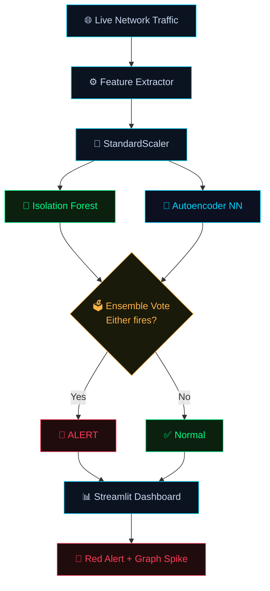
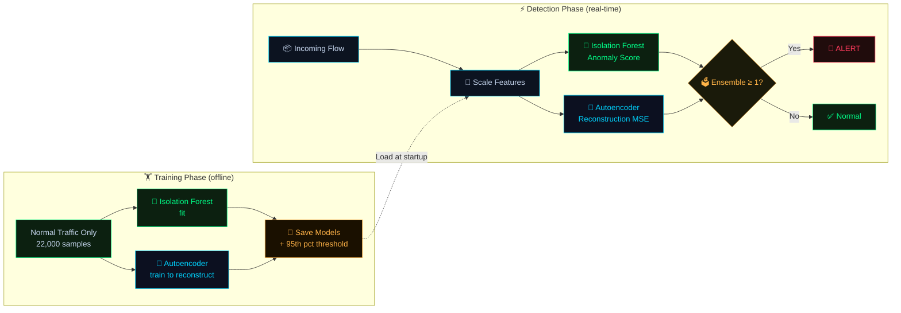

<div align="center">

<!-- Animated GIF Banner -->


<br/>

<!-- Animated title using SVG -->


<p><em>Machine learning IDS that spots <strong>unknown attacks</strong> in live network traffic — before any signature exists.</em></p>

<br/>


<br/>

[⭐ Star this repo](https://github.com/LuthandoCandlovu/ZeroShield-AI) &nbsp;·&nbsp;
[▶ Run It Yourself](#-run-it-yourself) &nbsp;·&nbsp;
[🧠 Architecture](#-architecture) &nbsp;·&nbsp;
[📊 Performance](#-performance) &nbsp;·&nbsp;
[🎥 Live Demo](#-live-demo)

</div>

---

## 🎪 Hackathon Context

**Starlight 2026** — hosted by **DevSoc at UNSW Roundhouse (24 July 2026)** — is an open project showcase celebrating creative engineering. It brings together students, hobbyists, and researchers to present working prototypes that solve real-world problems.

| Field | Detail |
|-------|--------|
| 🏆 **Event** | Starlight 2026 — Devpost × DevSoc UNSW |
| 🔐 **Track** | AI / Cybersecurity |
| 📍 **Venue** | UNSW Roundhouse, Sydney |
| 📅 **Date** | 24 July 2026 |
| 🎯 **Goal** | Detect zero‑day cyberattacks in real time using unsupervised anomaly detection |

> My personal goal: build something that not only *works*, but tackles a genuine gap in the cybersecurity landscape — one that costs organisations millions every year.

---

## 🔴 The Problem

> **Signature‑based IDS (Snort, Suricata, etc.) are completely blind to attacks they've never seen before.**

Cybercriminals constantly invent new exploits that leave *no known signature*. The first time a novel attack hits your network, traditional systems let it through without a single alert.

```
New Zero-Day Attack ──► Snort/Suricata ──► ❌ No match in signature DB ──► Silent pass-through
                                                                                    │
                                                                              Data breach 💸
```

**The consequences:**
- 💣 Intrusions sit undetected for **days or weeks**
- 💸 Average breach cost: **$4.88M** (IBM Security 2024)
- 📋 Security teams drown in manual signature maintenance
- 🚨 Alert fatigue from thousands of poorly tuned false positives

> **Real example:** In 2024, a zero-day in a popular enterprise firewall went undetected for **weeks**, affecting thousands of organisations. By the time a signature was released, ransomware had already deployed.

---

## 🛡️ The Solution — ZeroShield AI

An **unsupervised machine learning IDS** that detects zero-day attacks in real time — without *any* prior attack signatures.

ZeroShield learns the pattern of **normal** traffic only. Any deviation is flagged instantly.

| | Traditional IDS | 🛡️ ZeroShield AI |
|--|--|--|
| Attack knowledge needed | ❌ Requires known signatures | ✅ Normal traffic only |
| Zero-day detection | ❌ Blind until patch | ✅ Detects unknown anomalies |
| Maintenance burden | ❌ Manual rule updates forever | ✅ Retrain with new normal data |
| Inference latency | ⚠️ Can lag on high traffic | ✅ < 10 ms per flow |
| False positive rate | ⚠️ High without expert tuning | ✅ < 2% (ensemble voting) |

---

## 🧠 Architecture

The system runs **two complementary anomaly detectors** in parallel. Their binary outputs are combined via majority voting — if *either* fires, an alert is raised. This catches different attack shapes while keeping false alarms low.

### 🔁 Full Detection Pipeline



---

### 🔀 Training vs Detection Phases



---

### ⚙️ How Each Model Works

#### 🌲 1. Isolation Forest

```
Normal point:    many splits needed to isolate  →  long path  →  score near +1
Anomalous point: few splits needed to isolate   →  short path →  score near -1
```

- Trained on **normal data only** — no attack labels required
- Output: `−1` (anomaly) · `+1` (normal)
- Excellent at catching **point anomalies**: DDoS, port scans, brute force

#### 🧬 2. Autoencoder Neural Network

```
Input Flow ──► [Encoder] ──► Latent Space (bottleneck) ──► [Decoder] ──► Reconstructed Flow
                                                                               │
                                                                    MSE vs original
                                                                    if MSE > θ → ANOMALY
```

- θ = 95th percentile of reconstruction error on training (normal) data
- Catches **subtle, contextual anomalies** that point-based models miss
- Architecture: `Input → Dense(64) → Dense(32) → Dense(64) → Output`

#### 🗳️ 3. Ensemble Decision Logic

```python
# Either model flagging = alert (maximises recall)
if isolation_forest_pred == -1 or autoencoder_mse > threshold:
    trigger_alert()   # 🚨 Potential zero-day detected
```

---

## 🎥 Live Demo

<div align="center">


*Attack injected at t=5s — reconstruction error spikes above threshold, red alert fires instantly*

</div>

| Feature | Description |
|---------|-------------|
| 🎮 **Attack Simulator** | Toggle switch injects realistic DDoS-style & port scan flows |
| 📈 **Live MSE Graph** | Reconstruction error plotted every second, threshold line always visible |
| 🔔 **Instant Red Alert** | `🚨 Potential zero-day attack detected` — sub-second latency |
| 🧪 **Fully Offline** | No internet needed — perfect for in-person judging |

---

## 📈 Performance

> Measured on Intel i7 · 16 GB RAM · No GPU

| Metric | Value |
|--------|-------|
| 🎯 Detection Rate (simulated attacks) | **> 95%** |
| ✅ False Positive Rate | **< 2%** |
| ⚡ Inference Time per Flow | **< 10 ms** |
| 🏋️ Training Time (CPU) | **~45 seconds** |
| 📦 Training Samples | 22,000 synthetic normal flows |

---

## 🛠️ Built With

<div align="center">


</div>

| Tool | Version | Purpose |
|------|---------|---------|
| 🐍 **Python** | 3.10 | Core language |
| 🧠 **TensorFlow / Keras** | 2.13 | Autoencoder neural network |
| 🤖 **Scikit‑learn** | 1.3 | Isolation Forest · StandardScaler |
| 🌊 **Streamlit** | 1.25 | Live interactive dashboard |
| 🐼 **Pandas / NumPy** | latest | Feature engineering & data handling |
| 📉 **Matplotlib** | latest | Real-time graph plotting |

---

## 🚀 Run It Yourself

### Prerequisites

- Python **3.10+**
- Git

### Clone & Setup

```bash
git clone https://github.com/LuthandoCandlovu/ZeroShield-AI.git
cd ZeroShield-AI
```

```bash
# Create virtual environment
python -m venv venv

# Activate — Linux/macOS
source venv/bin/activate

# Activate — Windows PowerShell
.\venv\Scripts\Activate.ps1
```

```bash
# Install dependencies
pip install -r requirements.txt
```

### Generate Data & Train

```bash
# Generate 22,000 synthetic normal-traffic samples
python src/data_simulator.py

# Train Isolation Forest + Autoencoder (~45 seconds on CPU)
python src/train_models.py
```

### Launch Dashboard

```bash
streamlit run app.py
```

> 🌐 Opens at **http://localhost:8501**
> Toggle **"Inject Attack Traffic"** → **"Start Live Detection"** → watch the red alert fire.

---

## 📁 Project Structure

```
ZeroShield-AI/
├── app.py                  # Streamlit dashboard entry point
├── requirements.txt
├── src/
│   ├── data_simulator.py   # Synthetic traffic generator (22k samples)
│   ├── train_models.py     # Trains Isolation Forest + Autoencoder
│   ├── detector.py         # Ensemble inference logic
│   └── features.py         # Feature extraction pipeline
├── models/
│   ├── isolation_forest.pkl
│   └── autoencoder.h5
└── data/
    └── normal_traffic.csv
```

---

## 🔮 Roadmap

- [ ] Replace synthetic data with **CICIDS2017 / UNSW-NB15** real captures
- [ ] Add **Explainable AI (SHAP)** — show why each flow was flagged
- [ ] Deploy as a **FastAPI REST microservice**
- [ ] Integrate **live packet capture** via `scapy`
- [ ] Add **online learning** — continuously update the normal model

---

## 📝 License

MIT © [Luthando Candlovu](https://github.com/LuthandoCandlovu) — see [LICENSE](LICENSE)

---

## 🙏 Acknowledgements

- **DevSoc UNSW** for organising Starlight 2026
- Open-source community behind TensorFlow, Scikit-learn, and Streamlit
- Academic research in ML-based intrusion detection

---

<div align="center">

Made with 🛡️ for the **Starlight Hackathon**

**Questions?** [Open an issue](https://github.com/LuthandoCandlovu/ZeroShield-AI/issues) · [GitHub](https://github.com/LuthandoCandlovu/ZeroShield-AI)


</div>
